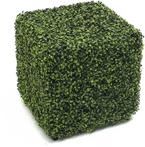

# Hedge ·   

Hedge is a platform agnostic ClojureScript framework for deploying ring compatible handlers to various environments with focus on serverless deployments.

## Repository Contents

 - [/library](/library) contains wrapping and transformation code for adapting handlers to various platforms
 - [/boot](/boot) contains Hedge specific Boot tasks for code generation
 - [/acceptance](/acceptance) contains Concordion based acceptance test suite which also works as technical documentation on how to use Hedge

## Known Limitations

 - asynchronous ring handlers not yet supported

## Supported Platforms

### [Azure Functions](https://azure.microsoft.com/en-us/services/functions/)

## License

Copyright © 2016-2017 [Siili Solutions Plc.](http://www.siili.com)

Distributed under the [Eclipse Public License 1.0.](https://www.eclipse.org/legal/epl-v10.html)
